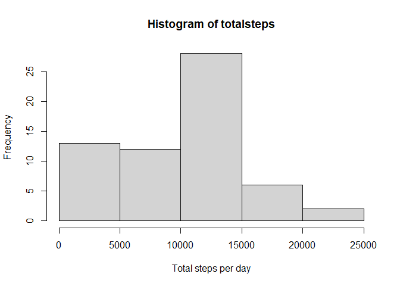
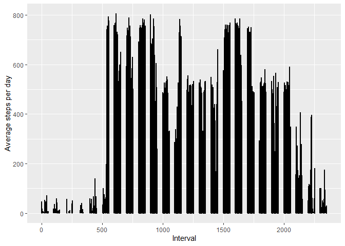

Introduction
------------

A large amount of data can now be collected about personal movement
using activity monitoring devices such as a Fitbit, Nike Fuelband,
Jawbone Up etc. But these data remain under-utilized both because the
raw data are hard to obtain and there is a lack of statistical methods
and software for processing and interpreting the data. This assignment
makes use of data from a personal activity monitoring device. This
device collects data at 5 minute intervals through out the day. The data
consists of two months of data from an anonymous individual collected
during the months of October and November, 2012 and include the number
of steps taken in 5 minute intervals each day.

Data
----

The data for this assignment can be downloaded using the following URL:-
“<a href="https://d396qusza40orc.cloudfront.net/repdata%2Fdata%2Factivity.zip" class="uri">https://d396qusza40orc.cloudfront.net/repdata%2Fdata%2Factivity.zip</a>”

The variables included in this dataset are:

1.  steps: Number of steps taking in a 5-minute interval
2.  date: The date on which the measurement was taken in YYYY-MM-DD
    format
3.  interval: Identifier for the 5-minute interval in which measurement
    was taken The dataset is stored in a comma-separated-value (CSV)
    file and there are a total of 17,568 observations in this dataset.

Loading and processing the data
-------------------------------

    library(ggplot2)
    library(dplyr)

    url<- "https://d396qusza40orc.cloudfront.net/repdata%2Fdata%2Factivity.zip"
    download.file(url, destfile = paste0(getwd(), '/zipfile.zip'))
     unzip("zipfile.zip")
     
     activitydata<- read.csv('activity.csv')
     activitydata$date <- as.Date(activitydata$date, '%Y-%m-%d')

Mean total number of steps taken per day
----------------------------------------

**Calculate the total number of steps taken per day**

    totalsteps <- tapply(activitydata$steps, activitydata$date, sum, na.rm=T)
    head(totalsteps)

    ## 2012-10-01 2012-10-02 2012-10-03 2012-10-04 2012-10-05 2012-10-06 
    ##          0        126      11352      12116      13294      15420

**Histogram of the total number of steps taken each day**

    hist(totalsteps, xlab="Total steps per day")

**Mean and median of the total number of steps taken per day**

    summary(totalsteps)

    ##    Min. 1st Qu.  Median    Mean 3rd Qu.    Max. 
    ##       0    6778   10395    9354   12811   21194

Average daily activity pattern
------------------------------

**Time series plot of the 5-minute interval (x-axis) and the average
number of steps taken, averaged across all days (y-axis)**

    averagesteps <- activitydata %>% filter(!is.na(steps)) %>% group_by(interval) %>% summarize(steps = mean(steps))

    ## `summarise()` ungrouping output (override with `.groups` argument)

    ggplot(activitydata, aes(x=interval, y=steps)) + geom_line(size=1)+ labs(x = "Interval", y = "Average steps per day")

    ## Warning: Removed 2 row(s) containing missing values (geom_path).

**Which 5-minute interval, on average across all the days in the
dataset, contains the maximum number of steps?**

    maxsteps <- averagesteps[which.max(averagesteps$steps), ][[1]]
    maxsteps

    ## [1] 835

Imputing missing values
-----------------------

**The total number of missing values in the dataset**

    missing<- is.na(activitydata)
    sum(missing)

    ## [1] 2304

**We will fill in the NA values with mean number of steps** **New
dataset that is equal to the original dataset but with the missing data
filled in**

    finalsteps <- activitydata$steps
    finalsteps[is.na(finalsteps)] <- round(mean(activitydata$steps, na.rm = T))
    finalsteps <- as.numeric(finalsteps)
    finaldata <- cbind(finalsteps, activitydata$date, activitydata$interval)
    colnames(finaldata) <- colnames(activitydata)
    finaldata<- as.data.frame(finaldata)

**Histogram of the total number of steps taken each day**

    finaltotalsteps <- tapply(finaldata$steps, finaldata$date, sum)
    hist(finaltotalsteps, xlab="Total steps per day")

**Mean and median total number of steps taken per day**

    summary(finaltotalsteps)

    ##    Min. 1st Qu.  Median    Mean 3rd Qu.    Max. 
    ##      41    9819   10656   10752   12811   21194

The mean and median total number of steps taken per day increase
slightly with the imputation of the missing values.

Are there differences in activity patterns between weekdays and weekends?
-------------------------------------------------------------------------

**New factor variable in the dataset with two levels – “weekday” and
“weekend” indicating whether a given date is a weekday or weekend day.**

    finaldata$date <- as.POSIXct.Date(finaldata$date)
    weekd <-c('Monday', 'Tuesday', 'Wednesday', 'Thursday', 'Friday')
    finaldata$weekday <- factor((weekdays(finaldata$date) %in% weekd), levels = c(FALSE, TRUE), labels = c('weekend', 'weekday'))

**Panel plot containing a time series plot of the 5-minute interval
(x-axis) and the average number of steps taken, averaged across all
weekday days or weekend days (y-axis)**

    finalavgsteps<- finaldata %>% group_by(interval, weekday) %>% summarise(steps = mean(steps))

    ## `summarise()` regrouping output by 'interval' (override with `.groups` argument)

    ggplot(finalavgsteps, aes(x=interval, y=steps)) +
            geom_line(size=1) + 
            facet_grid(weekday~.)

